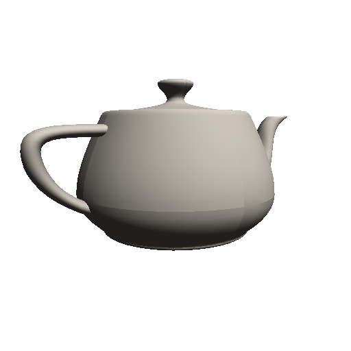
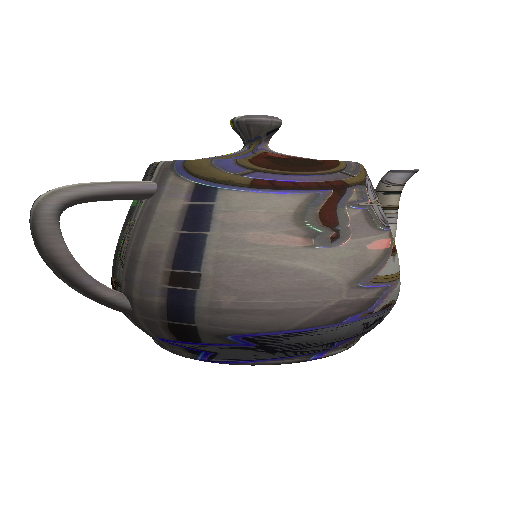

# miniGPU 🫖 — 3D 軟體 GPU + 真 LLVM Backend

從 [ToyGPU](https://github.com/ryansoq/ToyGPU)（教學骨架：一個 2D 三角形 +
自寫 LLVM target）長出來，補上完整 3D 圖形管線。

```
3D 頂點 → Vertex(MVP 變換) → Rasterizer(+Z-buffer) → Fragment(打光/貼圖) → PNG
```

## 成果

**Utah 茶壺**（3D 管線 + Z-buffer 遮擋 + Lambert 打光）：



**芙莉蓮茶壺**（+ 貼圖：閃卡當 texture，圓柱投影 UV + 雙線性取樣）：



## 進度

- [x] v1 base 搬移（gpu/ toygl/ toyasm/ tests/ + LLVM backend/）
- [x] **3D 管線**：math3d（MVP）+ vertex 變換 + Z-buffer + Lambert 打光 → Utah 茶壺 ✅
- [x] **貼圖**：圓柱投影 UV + software texture unit（雙線性取樣）→ 芙莉蓮茶壺 ✅
- [ ] 旋轉動畫（canvas real-time loop）
- [ ] 更重的模型（Stanford Bunny/Dragon）+ 加速（SIMT / culling）
- [ ] 把 3D fragment 接回 v1 的真 SPIR-V→LLVM→ISA 編譯鏈

## 跑

```bash
# 3D 茶壺
g++ -std=c++17 -O2 teapot.cpp gpu3d/renderer3d.cpp -o teapot && ./teapot

# 貼圖版
g++ -std=c++17 -O2 teapot_tex.cpp gpu3d/renderer3d.cpp gpu3d/texture.cpp -o teapot_tex && ./teapot_tex
```

## 兩層架構

| 層 | 內容 | 狀態 |
|---|---|---|
| **3D 管線**（gpu3d/） | math3d + renderer3d + texture — vertex/raster/fragment/Z-buffer，純 C++ | ✅ 畫得出茶壺 |
| **ISA + LLVM backend**（gpu/ toyasm/ backend/） | ToyGPU ISA interpreter + 真 LLVM target（`llc -mtriple=toygpu`） | ✅ 從 v1 繼承 |

現階段 3D 的 vertex/lighting 用 C++ 直算驗證管線；fragment shader 之後可
接回底層那條真編譯鏈（GLSL→SPIR-V→LLVM IR→ToyGPU ISA）。

## LLVM Backend Porting

真 LLVM target porting（fork llvm-project @ 20.1.8，加一個 `toygpu` target）
的完整過程與踩坑實錄見 **[backend/BUILD.md](backend/BUILD.md)** —— 8 個具體
問題（tblgen 型別要求、SelectionDAGTargetInfo segfault、isFPImmLegal、
timm vs imm、STOUT 的 hasSideEffects 防 DCE…）及解法，是「如何 port 一個
LLVM target」的第一手教材。

```bash
bash backend/setup-llvm.sh          # clone + Triple patch + symlink + cmake
ninja -C ~/llvm-project/build llc   # 第一次 ~30-60 分鐘
~/llvm-project/build/bin/llc -mtriple=toygpu frag.ll -o frag.s
```
